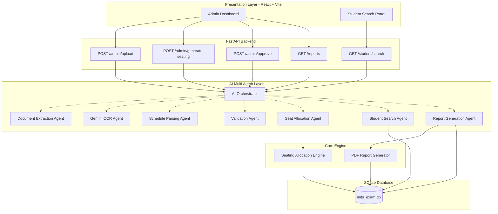

# Alloc8: System Architecture & Reference Guide

This document provides a comprehensive architectural breakdown of **Alloc8 (AI-Powered Examination Seating Planning and Student Seating Finder System)**. It details each layer of the application stack, explaining the roles, endpoints, intelligence agents, core engines, and database relationships exactly as structured in the system architecture model.

---

## 📐 1. System Architecture Overview

Alloc8 is organized as a decoupled, multi-layered system designed to solve automated examination layouts and high-speed student lookups.

---

## 💻 2. Layer 1: Presentation Layer (React + Vite)
The frontend client interface is developed using React, Vite, and custom CSS variables, giving it a premium glassmorphic visual style. It consists of two primary portals:

### A. Admin Dashboard
The administrative gateway for exam organizers:
* **Session & Room Management**: Interface to create, view, and toggle active exam sessions, as well as define physical classroom benches and strategy grids.
* **Intelligent File Upload**: Drag-and-drop zone that allows admins to upload student registration lists, master schedules, or physical seating images.
* **Planner Control Panel**: Allows administrators to preview simulated allocations, verify student distributions, commit seating arrangements, and export PDF assets.

### B. Student Search Portal
A public portal optimized for high-traffic lookup days:
* **Seat Lookup Engine**: Allows students to query their roll number.
* **Interactive Seating Grid**: Dynamically renders a 2D floor visual showing row, column, and bench positions. The student's seat is highlighted with a pulsing glow.
* **Digitized Slip / QR Code**: Renders a printable hall ticket containing dates, locations, and a QR code for quick scanning.

---

## ⚙️ 3. Layer 2: API Layer (FastAPI Backend)
An asynchronous Python FastAPI server exposing RESTful endpoints.

* **`POST /admin/upload`**  
  Accepts uploaded Excel spreadsheets, digital PDFs, or image scans of student registrations or master timetables and forwards them to the AI Orchestrator.
* **`POST /admin/generate-seating`**  
  Initiates a simulated seating allocation for a specific session and exam slot.
* **`POST /admin/approve`**  
  Saves a simulated seating preview to the database, finalizing the layout for lookup queries.
* **`GET /reports`**  
  Streams generated PDF reports (door sheets, notice-board grids, or sign-in sheets) back to the admin.
* **`GET /student/search`**  
  Evaluates query coordinates in $O(1)$ time, returning the precise block, room, and relative seating coordinates.

---

## 🤖 4. Layer 3: AI Multi-Agent Layer
The intelligence hub of the application. The **AI Orchestrator** functions as the central dispatch, routing raw files and requests through seven specialized agents:

### 1. Document Extraction Agent
* **Role**: Parses standard digital file formats (PDFs and Excel worksheets).
* **Operation**: Uses libraries like `pdfplumber` to pull raw text formatting and `openpyxl` to traverse cells and convert rows into structured piped strings.

### 2. Gemini OCR Agent
* **Role**: Handles unstructured visual data (photo scans or images of seating timetables).
* **Operation**: Pings the Google Gemini API (`gemini-2.5-flash`) with image parameters to perform optical character recognition while preserving structural grid rows.

### 3. Schedule Parsing Agent
* **Role**: Translates raw text structures into normalized database schedules.
* **Operation**: Standardizes exam dates and slots using regex parsing patterns.

### 4. Validation Agent
* **Role**: Enforces integrity and checks constraint boundaries before database insertion.
* **Operation**: Compares parsed ranges against room capacities and flags warnings for duplicate student registrations or room overflows.

### 5. Seat Allocation Agent
* **Role**: Bridges the orchestrator and the allocation calculation logic.
* **Operation**: Fetches active student pools and room properties, setting up the planning parameters for the core allocation engine.

### 6. Student Search Agent
* **Role**: Resolves coordinates and builds user response matrices.
* **Operation**: Queries range allocations, computes flat-index seat positions, and maps them to row, column, and desk-side coordinates.

### 7. Report Generation Agent
* **Role**: Builds and exports document generation specifications.
* **Operation**: Compares database seating metadata and instructs the PDF generator to draw specific canvas elements.

---

## 🧠 5. Layer 4: Core Engine
The execution engines that perform heavy computational and document generation logic:

### A. Seating Allocation Engine
Runs the **12-12 Checkerboard Pairing Algorithm** to ensure exam malpractice prevention:
* Groups students by subject, identifying the two largest subject pools (A and B).
* Allocates candidates alternately across seats.
  * **Single Seating**: 
    $$\text{Seat Subject} = \begin{cases} \text{Subject A} & \text{if } (\text{row} + \text{col}) \bmod 2 = 0 \\ \text{Subject B} & \text{otherwise} \end{cases}$$
  * **Double Seating**: 
    $$\text{Seat Subject} = \begin{cases} \text{Subject A} & \text{if } (\text{row} + \text{col} + \text{side}) \bmod 2 = 0 \\ \text{Subject B} & \text{otherwise} \end{cases}$$
* Isolates subjects to prevent same-subject candidates from sitting adjacent to each other.

### B. PDF Report Generator
A ReportLab-driven drawing engine:
* **Door Grid Charts**: Renders visual room layouts as vector graphics, showing bench assignments color-coded by subject.
* **Notice Board Sheets**: Tabulates student ranges (e.g. `23711A0501 - 23711A0530` in Room 202).
* **Invigilator Attendance Sheets**: Formats sign-in lists with signature blocks.

---

## 🗄️ 6. Layer 5: SQLite Database (`mits_exam.db`)
A local database engine. It contains the following tables:
* **`sessions`**: Represents exam intervals (e.g., "Semester Exams - July 2026").
* **`rooms`**: Configures building blocks, rooms, rows, columns, and capacity structures.
* **`seating_ranges`**: Maps range blocks (`start_num` to `end_num`) to target slots, dates, and subjects.
* **`student_registrations`**: Stores ingestion data for active student registries.
* **`exam_schedules`**: Timetables mapping dates and times to specific subjects.
* **`settings`**: Key-value settings storing API keys and administrative authentication tokens.
